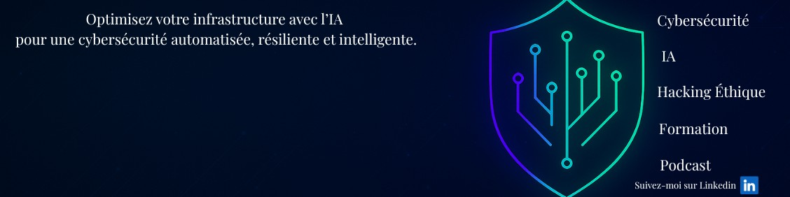

# 👋 Bonjour, je suis Franck

🎯 **Administrateur IT & Automatisation IA** basé à Toulouse.  
Je conçois des solutions **sécurisées** et **intelligentes** pour automatiser les workflows, optimiser les infrastructures informatiques et améliorer la productivité en entreprise.

---

## 🚀 Besoin de renforcer votre système ou d'automatiser vos opérations ?

Je vous accompagne dans :
- Le **pilotage d'infrastructure IT sécurisée** (sauvegardes, supervision, réseaux)
- L’**automatisation de processus métiers** via des scripts Bash, Python, No-Code (N8N)
- Le **reporting automatisé** et alerting proactif
- La création de **bots IA pour Helpdesk et support technique**

📧 Contact : [franck.friard@backboneagency.tech](mailto:franck.friard@backboneagency.tech)

---

## 🔗 Restons connectés

- [LinkedIn](https://www.linkedin.com/in/franck-friard-527816218/)

---

## 🧠 Ce que je partage

🎯 Mon travail est orienté autour de l’**efficacité IT**, de l’**automatisation des opérations** et de l’intégration **IA + No-Code** dans les environnements techniques.

### 📊 Projets à venir :

- 🔁 Déploiement de solutions d’automatisation N8N pour tickets IT
- 🤖 Intégration de GPT (ChatGPT) pour support utilisateur & alerting
- 🧩 Scripts Bash & Python pour supervision, sauvegarde, mises à jour
- 📬 Génération de rapports HTML + email automatisé
- 📦 Dashboard local pour suivi d’incidents en temps réel

---

## 🧰 Projets publics bientôt disponibles :

| Projet | Description | Langage |
|--------|-------------|---------|
| `infra-alert-bot` | Bot IA d’alerte automatique pour incidents IT | Python/N8N |
| `report-emailer` | Générateur de rapports HTML envoyés par email | Python |
| `n8n-helpdesk-agent` | Agent de support automatisé pour helpdesk | N8N |
| `infra-checker-bash` | Script Bash de vérification et alerting | Bash |

---

## ⚡ Compétences techniques clés

- **OS** : Linux (Debian, RedHat), Windows Server
- **Automatisation** : Bash, N8N, scripts Python
- **Monitoring** : Zabbix, Centreon, Nagios
- **Réseau** : VPN, VLAN, Firewall, NAT, TCP/IP
- **Langages** : Shell, Bash, HTML, SQL, Python, CSS

---

💬 N'hésitez pas à me contacter pour des collaborations, missions ou simplement échanger sur l'automatisation, la cybersécurité ou les outils IA !

